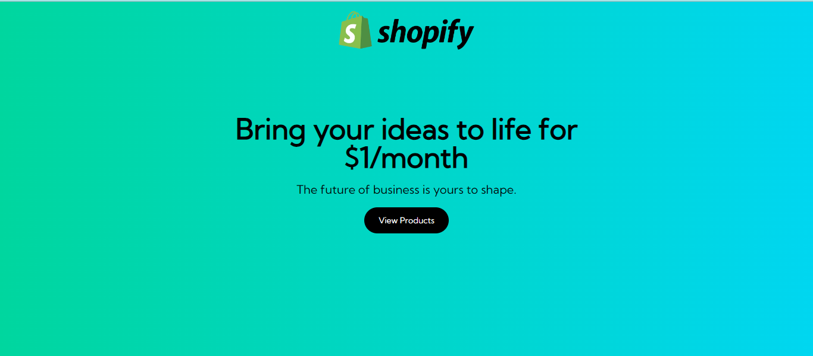
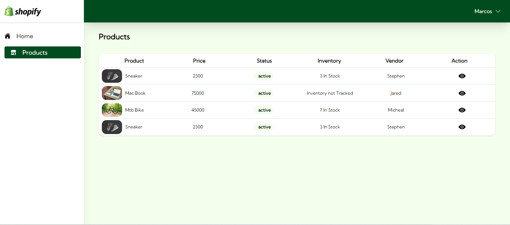
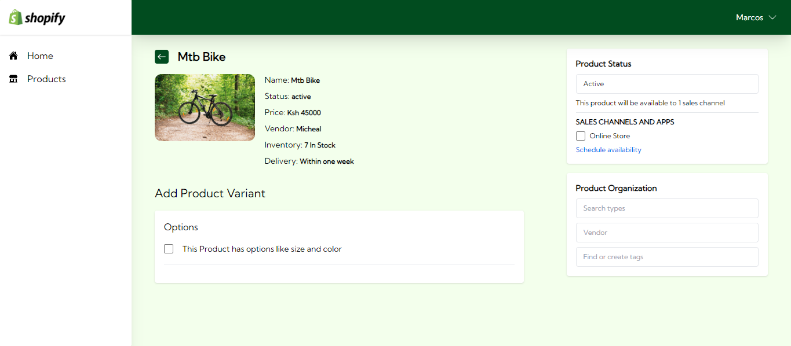

This is a [Next.js](https://nextjs.org/) project bootstrapped with [`create-next-app`](https://github.com/vercel/next.js/tree/canary/packages/create-next-app).

## Getting Started

First, run the development server:

```bash
npm run dev

```

Open [http://localhost:3000](http://localhost:3000) with your browser to see the result.


### Landing Page


### Products Page


### Product Details Page


### User flow Instructions

* Click the view products button in the landing page that takes you to the dashboard section.
* Under the Action column, click the "eye" icon to view the individual product details
* Below the product details, check the box to add your preferred variants to the product in question.
* You can add as many variants as possible as i have reused the same fields for adding an option name and its respective option values.
